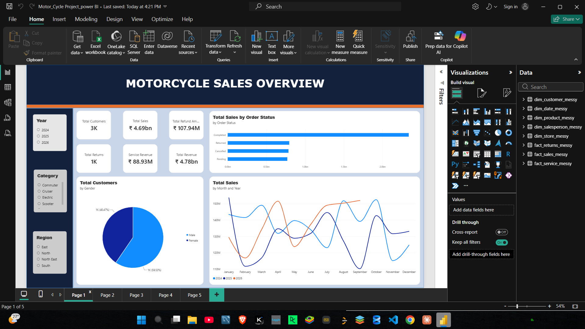
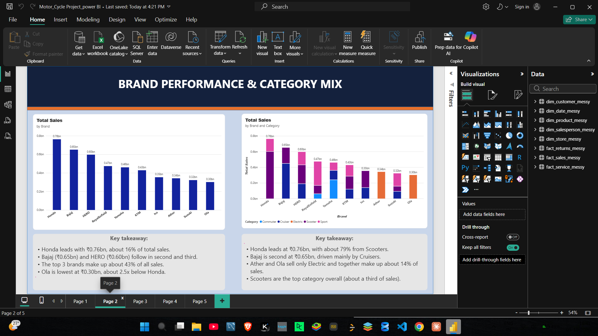
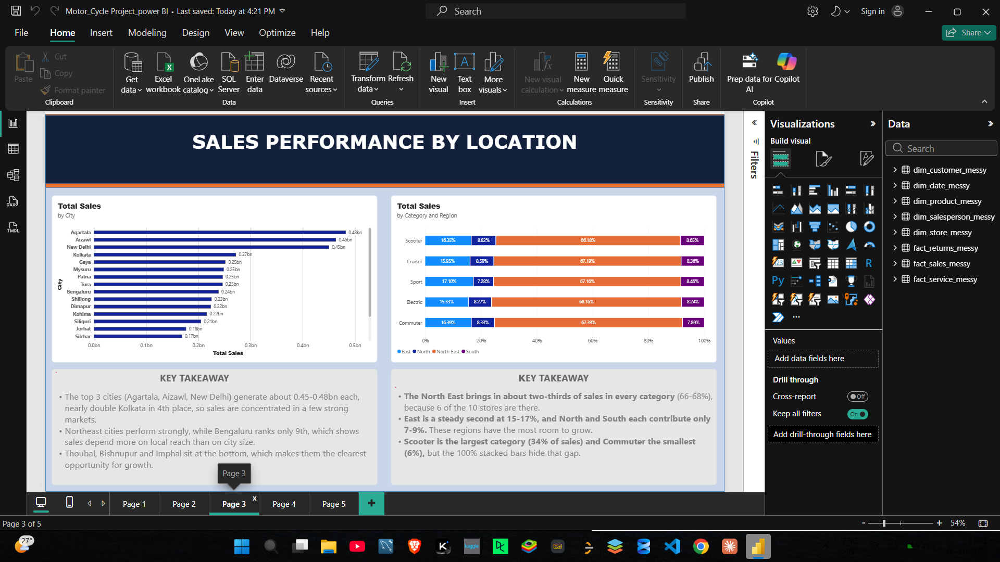
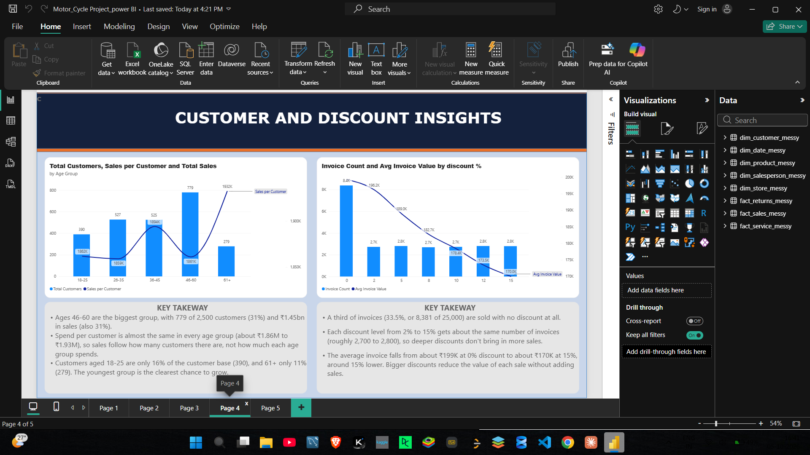
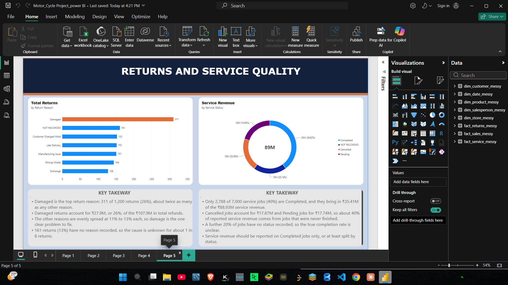

# Motorcycle Sales Analytics: Power BI Dashboard

A 5-page Power BI dashboard analysing sales, returns and service performance for a motorcycle dealer network, built on 25,000 invoices across 10 brands, 4 regions and 2024 to 2026.

**Tools:** Power BI Desktop · Power Query (M) · DAX · Star schema data modelling

---

## Dashboard Preview

| Page 1: Motorcycle Sales Overview | Page 2: Brand Performance & Category Mix |
|---|---|
|  |  |

| Page 3: Sales Performance by Location | Page 4: Customer and Discount Insights |
|---|---|
|  |  |

| Page 5: Returns & Service Quality |
|---|
|  |

---

## Business Questions

1. How are sales, orders and customers performing overall?
2. Which brands and categories drive revenue?
3. Which cities and regions sell the most, and where is the room to grow?
4. Who are the customers, and do discounts actually help?
5. How healthy are returns and after-sales service?

---

## Data Model

The data comes from 8 raw CSV files, loaded and cleaned in Power Query, and modelled as a star schema.

| Type | Table | Purpose |
|---|---|---|
| Fact | `fact_sales_messy` | Invoices: quantity, price, discount, net sales, payment method, order status |
| Fact | `fact_returns_messy` | Returns: quantity, reason, refund amount |
| Fact | `fact_service_messy` | Service jobs: type, category, amount, status |
| Dimension | `dim_customer_messy` | Customer, gender, age, age group, city |
| Dimension | `dim_date_messy` | Year, month, quarter, day, financial year |
| Dimension | `dim_product_messy` | Brand, model, category, engine CC, prices |
| Dimension | `dim_salesperson_messy` | Salesperson and designation |
| Dimension | `dim_store_messy` | Store, city, state, region |

Scale: 25,000 invoices · 2,500 customers · 10 stores · 7,000 service jobs · 1,200 returns.

---

## Data Cleaning (Power Query)

The source files were deliberately messy. Issues found and handled:

- **Inconsistent labels:** `complete` and `Completed` in `Order_Status` were merged into one value.
- **Placeholder values:** `N/A` and `n/a` in `Return_Reason` and `Service_Status` were relabelled as `Not Recorded`, so the gap shows up in the charts instead of looking like a real category.
- **Duplicate categories flagged:** `CARD` and `CREDIT CARD` in `Payment_Method` appear to be the same method.
- **Missing dates:** 1,227 invoices (about 5% of sales value) have no matching date in the date table.

---

## DAX Measures

```DAX
Total Sales = SUM(fact_sales_messy[Net_Sales])
Invoice Count = COUNTROWS(fact_sales_messy)
Avg Invoice Value = DIVIDE([Total Sales], [Invoice Count])

Total Customers = DISTINCTCOUNT(dim_customer_messy[Customer_ID])
Sales per Customer = DIVIDE([Total Sales], [Total Customers])

Total Returns = COUNTROWS(fact_returns_messy)
Total Refund Amount = SUM(fact_returns_messy[Refund_Amount])

Service Revenue = SUM(fact_service_messy[Service_Amount])
Completed Service Revenue =
    CALCULATE([Service Revenue], fact_service_messy[Service_Status] = "Completed")

Total Revenue = [Total Sales] + [Service Revenue]
```

---

## Key Insights

### Page 1: Overview
- Total sales are **₹4.69bn**, with **₹107.94M** in refunds and **₹88.93M** in service revenue.
- Only about **50% of sales value** (₹2.33bn) comes from Completed orders. Returned, Cancelled and Pending orders each make up roughly 16% to 17%.

### Page 2: Brand and Category
- **Honda** leads with ₹0.76bn (about 16% of sales). The top 3 brands (Honda, Bajaj, HERO) make up about **43%** of all sales.
- About 79% of Honda's sales come from Scooters, while Ather and Ola sell only Electric and together make up about 14% of sales.

### Page 3: Location
- The top 3 cities (Agartala, Aizawl, New Delhi) generate ₹0.45bn to ₹0.48bn each, nearly double Kolkata in 4th place.
- The **North East** brings in about two-thirds of sales in every category (66% to 68%), because 6 of the 10 stores are there. North and South contribute only 7% to 9% each.

### Page 4: Customers and Discounts
- Customers aged **46 to 60** are the largest group (31% of customers and 31% of sales).
- Spend per customer is almost the same across age groups (about ₹1.86M to ₹1.93M), so sales follow customer count, not individual spend.
- A third of invoices (33.5%) have **no discount**. Deeper discounts don't bring more invoices, and the average invoice value falls from about ₹199K at 0% to ₹170K at 15%.

### Page 5: Returns and Service Quality
- **Damaged** is the top return reason: 311 of 1,200 returns (26%), about twice as many as any other reason, and 26% of the ₹107.9M in refunds. 13% of returns have no reason recorded.
- Only **40%** of service jobs (2,788 of 7,000) are Completed. About 40% of reported service revenue comes from Cancelled or Pending jobs, so the headline figure overstates real service income.

---

## Recommendations

- Investigate packaging and handling to reduce damage-related returns.
- Report service revenue on Completed jobs only, and improve status tracking.
- Focus growth on North, South and the lowest-selling cities, which have the most room to grow.
- Review the discount policy, since discounts lower invoice value without adding volume.
- Target the 18 to 25 age group, the smallest customer segment relative to its potential.

---

## How to Open

1. Download `Motor_Cycle Project_power BI` from this repository.
2. Open it in **Power BI Desktop** (free from Microsoft).
3. Use the page tabs at the bottom and the slicers on Page 1 (Year, Category, Region) to explore.

---

## Repository Structure

```
├── README.md
├── ├── Motor_Cycle Project_power BI.pbix
├── screenshots/
│   ├── page1_overview.png
│   ├── page2_brand_category.png
│   ├── page3_location.png
│   ├── page4_customer_discount.png
│   └── page5_returns_service.png
└── data/            (raw CSV files)
```

---

## Author

**Gaipuibuan**
Aspiring Data Analyst · Power BI · SQL · Python
[LinkedIn](https://linkedin.com/in/gaipuibuan-panmei-a492b8377)
